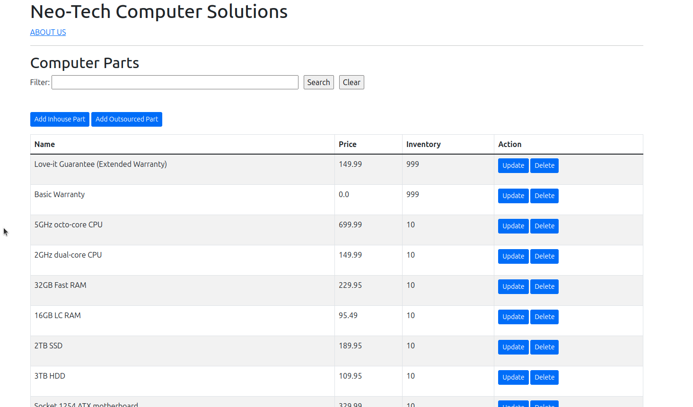

# Inventory Demo Web Application
A Spring Boot project  
* Java (v17)  
* Maven (v3.8.5)  
* Spring Boot (parent v2.6.6)
  * starter-data-jpa
  * starter-web
  * starter-thymeleaf
  * starter-validation
  * starter-test
  * H2
* Bootstrap CSS (5.1.3)

## Screenshot

## Description
This demo web application was a final project for a Java frameworks course. The web app demonstrates the usage of the 
Spring Framework and Spring Boot. It uses Thymeleaf for the front-end and Spring Data JPA to an H2 database for the back-end.
The intent of this course and demo represents first contact with these popular frameworks and libraries. As such, the 
project lacks much clean code!  
  
The application uses a standard Maven project structure featuring controllers, repositories, services, validators, 
and entities. The endpoints are mapped to Thymeleaf templates for server side rendering.  
  
The company reference in the application is fictitious.

## Usage
Clone the repository to your local machine and reload the Maven project.